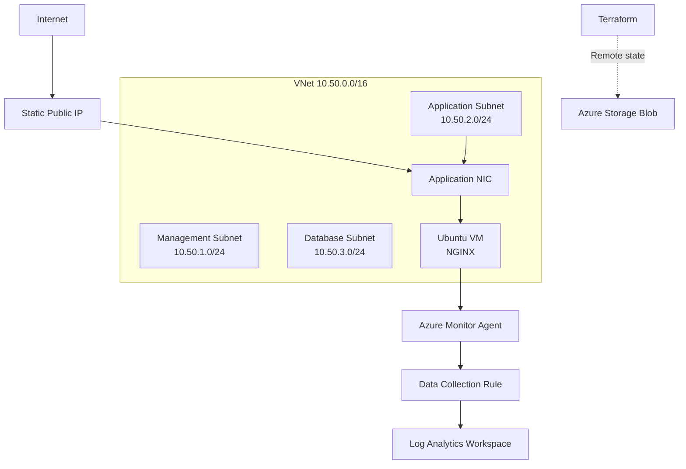
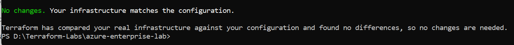
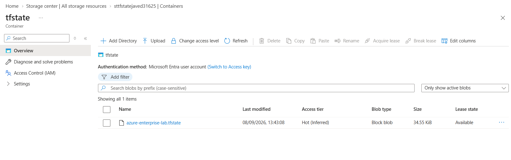
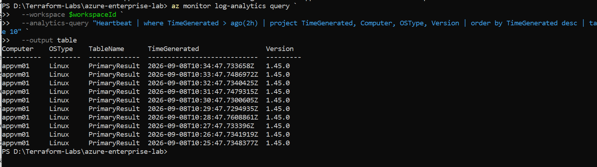
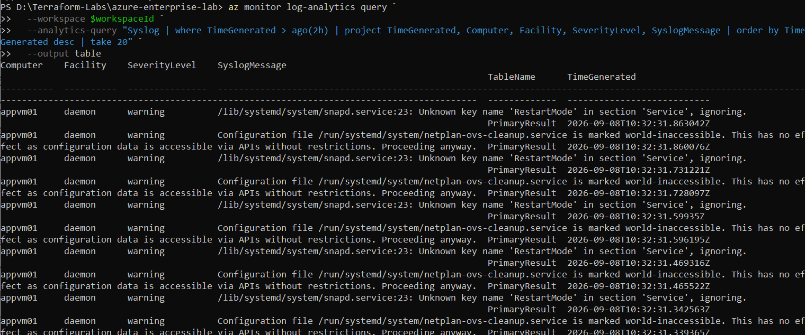

# Azure Enterprise Infrastructure Lab with Terraform

## Overview

This project demonstrates the deployment of a secure, monitored Azure infrastructure using Terraform.

It includes segmented networking, Network Security Groups, an Ubuntu application VM running NGINX, managed identity, Azure RBAC, Azure Monitor Agent, Log Analytics and remote Terraform state.

## Architecture



## Deployed Components

- Azure Resource Group
- Virtual Network with three segmented subnets
- Management, application and database NSGs
- Static public IP address
- Network interface
- Ubuntu Linux virtual machine
- NGINX web server deployed through cloud-init
- System-assigned managed identity
- Azure Reader role assignment
- Log Analytics workspace
- Azure Monitor Agent
- Linux Syslog Data Collection Rule
- Remote Terraform state in Azure Blob Storage

## Network Design

| Subnet | Address range | Purpose |
|---|---|---|
| Management | `10.50.1.0/24` | Management services |
| Application | `10.50.2.0/24` | Application VM and NGINX |
| Database | `10.50.3.0/24` | Database workloads |

The application NSG permits inbound HTTP traffic on TCP port 80. The database NSG permits SQL traffic on TCP port 1433 only from the application subnet.

## Project Structure

```text
.
├── compute.tf
├── main.tf
├── monitoring.tf
├── network.tf
├── outputs.tf
├── providers.tf
├── rbac.tf
├── security.tf
├── variables.tf
├── terraform.tfvars.example
├── .terraform.lock.hcl
├── .gitignore
└── README.md
```

## Prerequisites

- Azure subscription
- Azure CLI
- Terraform 1.16 or later
- SSH key pair
- Azure Storage backend for remote state

Authenticate to Azure:

```powershell
az login
```

Create the required SSH key if it does not already exist:

```powershell
ssh-keygen -t ed25519 -f "$env:USERPROFILE\.ssh\terraform-lab"
```

## Configuration

Copy the example variables file:

```powershell
Copy-Item .\terraform.tfvars.example .\terraform.tfvars
```

Update the values when required:

```hcl
location            = "uaenorth"
resource_group_name = "RG-Terraform-Enterprise-Lab"
vm_size             = "Standard_F1als_v7"
admin_username      = "azureadmin"
```

Configure the backend block in `providers.tf` with your own Azure Storage account and container.

## Deployment

```powershell
terraform init
terraform fmt -check
terraform validate
terraform plan
terraform apply
```

## Outputs

Terraform returns:

- Application private IP address
- Application public IP address
- NGINX application URL

Display outputs at any time:

```powershell
terraform output
```

## Monitoring Validation

The project uses the Azure Monitor Agent and a Data Collection Rule to send Linux warning-and-higher Syslog events to Log Analytics.

Example KQL query:

```kusto
Syslog
| where TimeGenerated > ago(2h)
| project TimeGenerated, Computer, Facility, SeverityLevel, SyslogMessage
| order by TimeGenerated desc
```

The monitoring configuration was validated using a custom Linux Syslog warning and recurring agent heartbeats.

## Validation Evidence

### Terraform Plan



### Azure Remote State



### Azure Monitor Agent Heartbeat



### Linux Syslog Collection



## Remote State

Terraform state is stored in a private Azure Blob container using Microsoft Entra ID authentication.

Remote state provides:

- Centralized state management
- State locking
- Improved protection against local state loss
- Support for team-based Terraform workflows

State files and local variable files are excluded from Git.

## Security Features

- Password authentication disabled on the Linux VM
- SSH key authentication
- Network segmentation with dedicated NSGs
- Restricted database access
- System-assigned managed identity
- Azure RBAC
- Microsoft Entra authentication for remote state
- Anonymous blob access disabled
- TLS 1.2 enabled on the backend storage account

## Cleanup

Destroy the workload infrastructure when it is no longer required:

```powershell
terraform destroy
```

The separately bootstrapped Terraform state storage should only be removed after the workload has been successfully destroyed.

## Author

**Mohd Javed**

- Microsoft Certified: Azure Administrator Associate (AZ-104)
- Microsoft Certified: Azure Solutions Architect Expert (AZ-305)